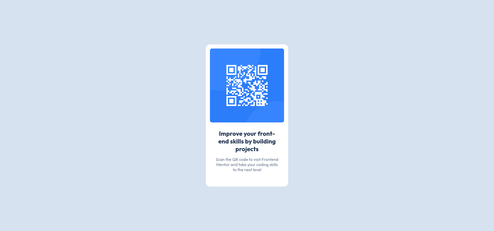
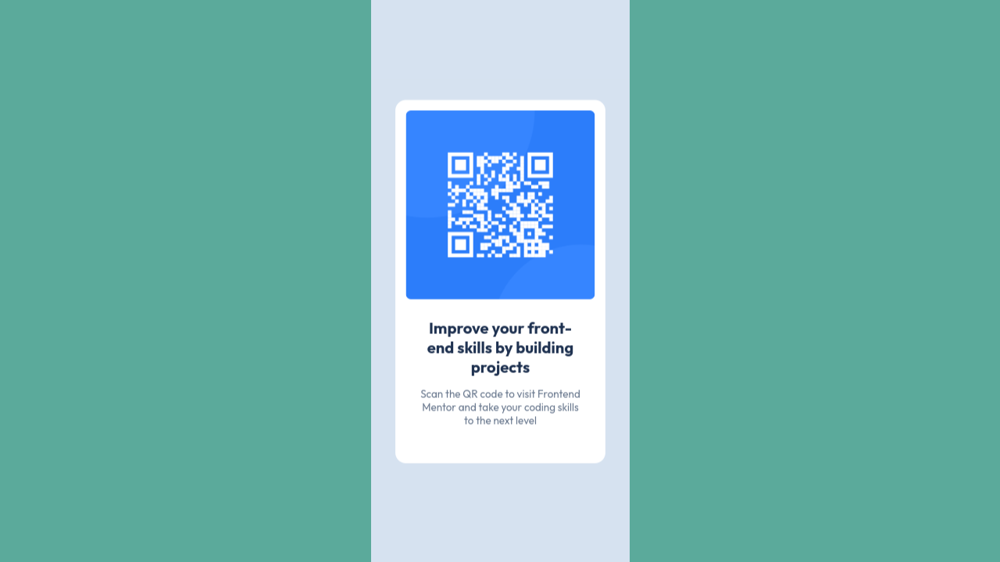

# Frontend Mentor - QR code component solution

This is a solution to the [QR code component challenge on Frontend Mentor](https://www.frontendmentor.io/challenges/qr-code-component-iux_sIO_H). Frontend Mentor challenges help you improve your coding skills by building realistic projects. 

## Table of contents

- [Overview](#overview)
  - [Screenshot](#screenshot)
  - [Links](#links)
- [My process](#my-process)
  - [Built with](#built-with)
  - [What I learned](#what-i-learned)
  - [Continued development](#continued-development)
  - [Useful resources](#useful-resources)
- [Author](#author)

## Overview

### Screenshot





### Links

- Solution URL: [Add solution URL here](https://github.com/MarcosAvg/qr-code-component)
- Live Site URL: [Add live site URL here](https://marcosavg.github.io/qr-code-component/)

## My process

### Built with

- Semantic HTML5 markup
- CSS custom properties
- Mobile-first workflow

### What I learned

In this challenge, I had to use a media query for the responsiveness of the component's growth; I learned a basic use of it.

```css
.card {
  background-color: var(--white);
  width: 90%;
  margin: 20vh auto;
  border-radius: 1rem;
}

@media (min-width: 375px)  {
  .card {
    width: 20rem;
  }
}
```

### Continued development

I would like to delve deeper into layout using Flexbox and Grid, as well as explore ways to achieve more responsiveness without requiring so many media queries.

### Useful resources

- [Media Queries](https://developer.mozilla.org/es/docs/Web/CSS/CSS_media_queries/Using_media_queries) - I used this resource to learn the syntax of media queries and their different ways of using them.
- [CSS custom properties](https://developer.mozilla.org/es/docs/Web/CSS/Using_CSS_custom_properties) - Here, I learned about the use of variables in CSS and their benefits.

## Author

- GitHub - [MarcosAvg](https://github.com/MarcosAvg)
- Frontend Mentor - [@MarcosAvg](https://www.frontendmentor.io/profile/MarcosAvg)